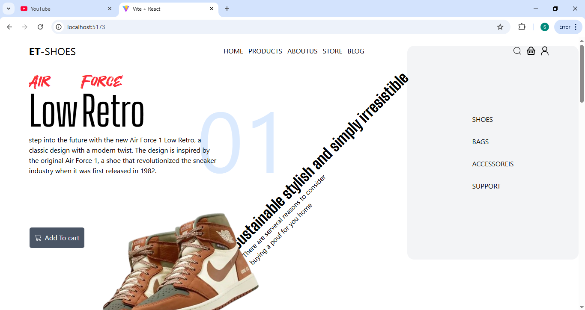

# Shoes website home page

Hi 👋, My name is Selamsew i am React and PHP developer, good at Mern Stack development.
## Overview
landing page for shoes ecommerece

## Technologies Used

1. React – For building the user interface

2. Tailwind CSS – For styling and responsiveness

## Installation

1. Clone the repository:

> git clone https://github.com/selamde/MovieSearchingApp](https://github.com/selamde/shoe-design.git

2. Navigate to the project folder:

> cd folder

3. open terminal and Install dependencies:

> npm install

5. Start the development server:
npm start

## Usage

- Open the app in your browser at http://localhost:5173/

## App looks like this

- Desktop view

"# et_shoes" 
"# et-shoes" 
# et-shoes
"# shoes-landing-page" 
# shoes-landing-page
"# shoe-design" 
